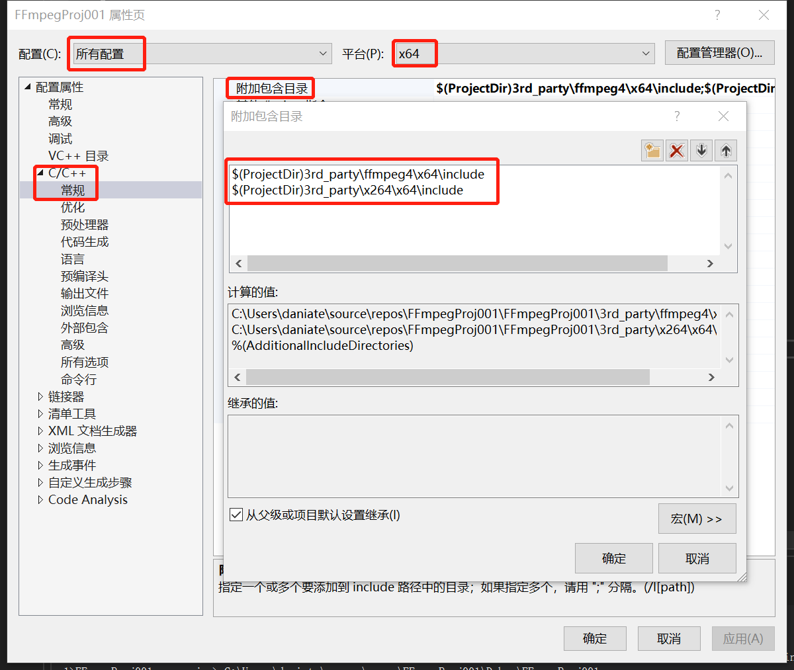
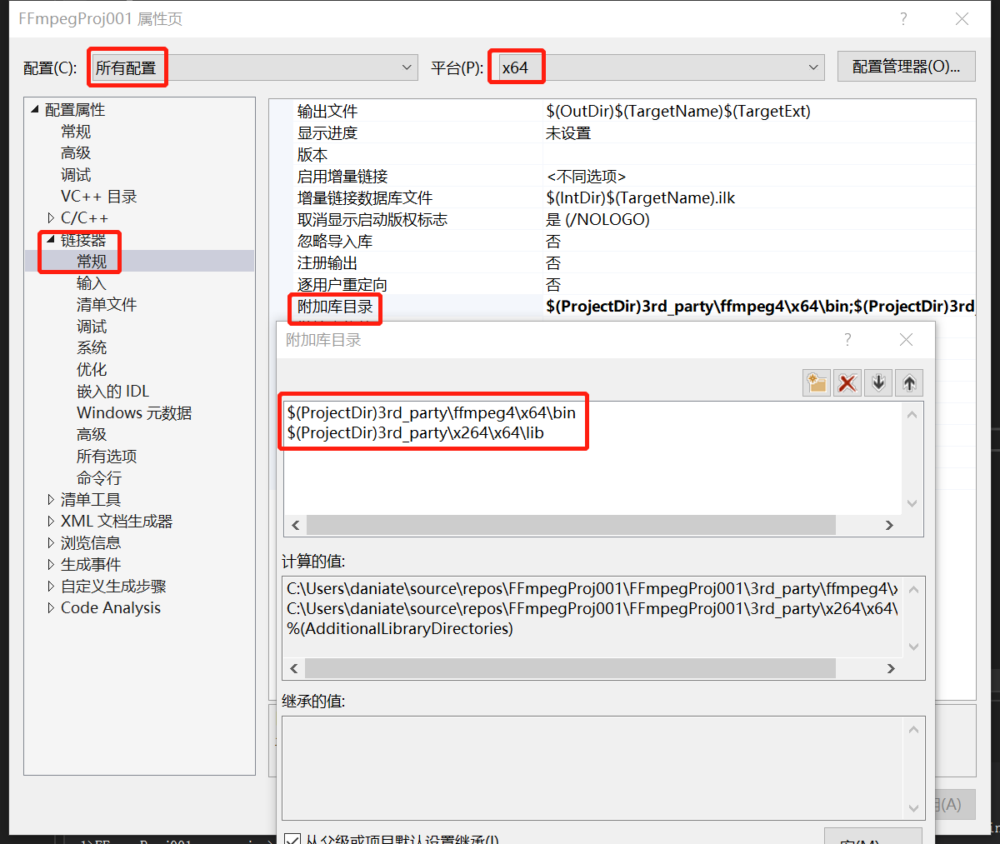
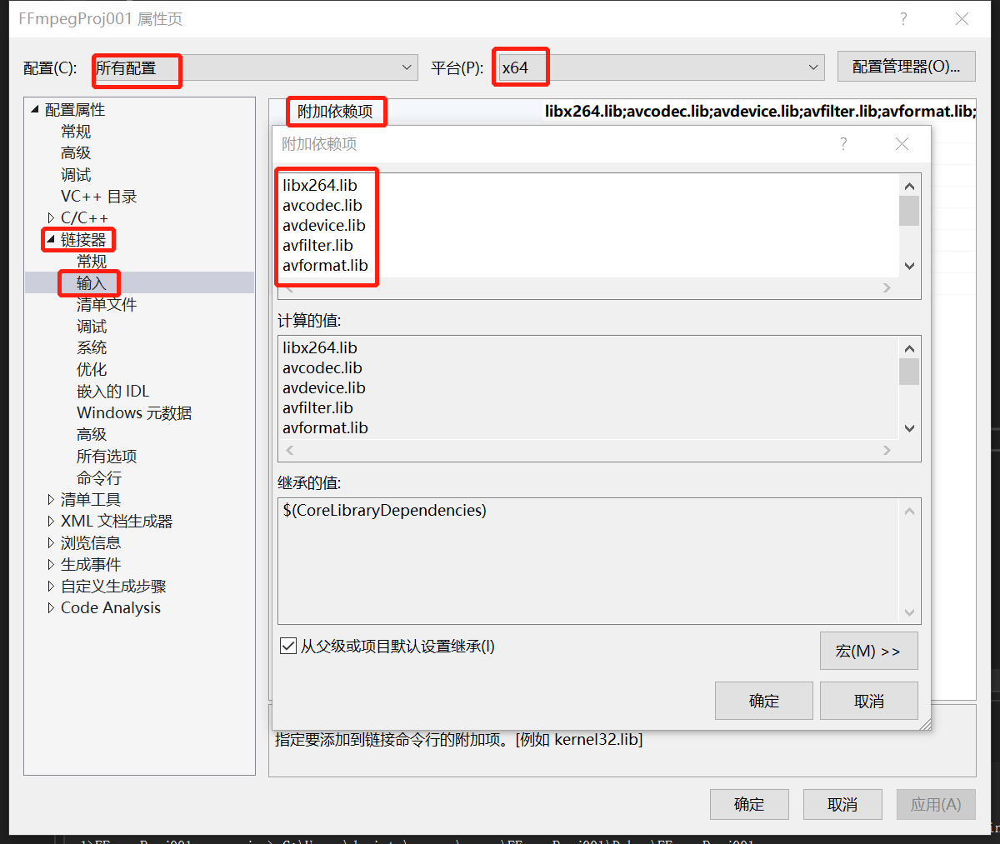
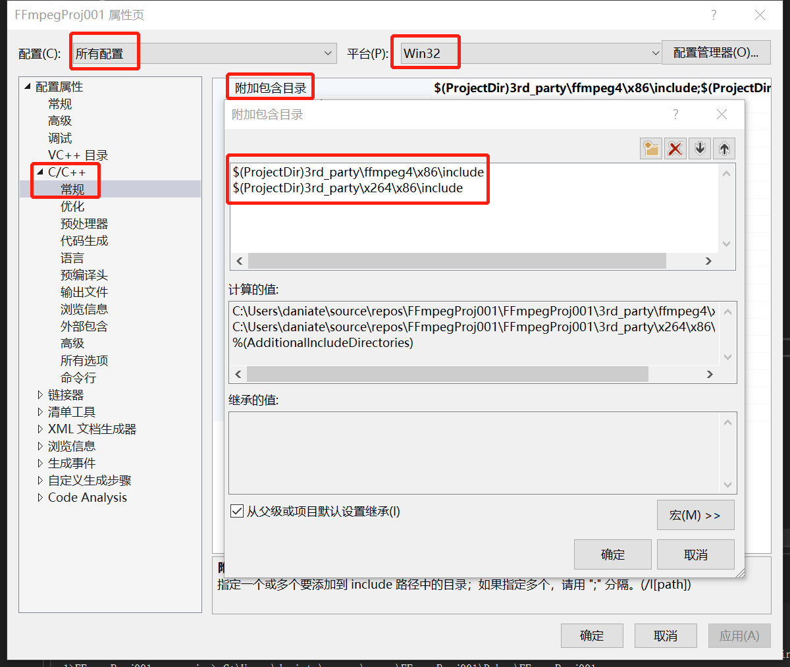
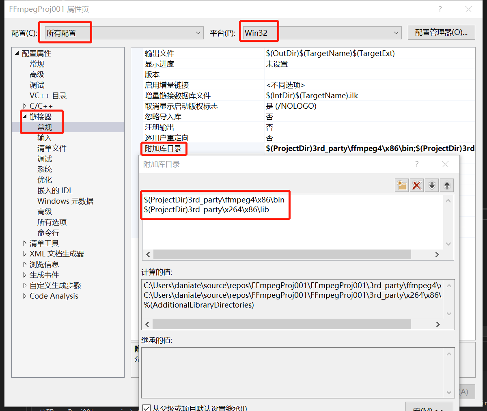
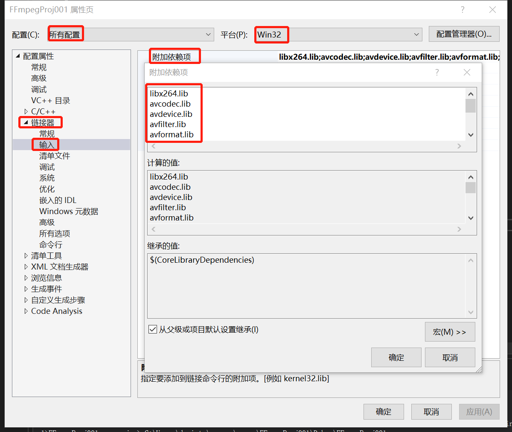
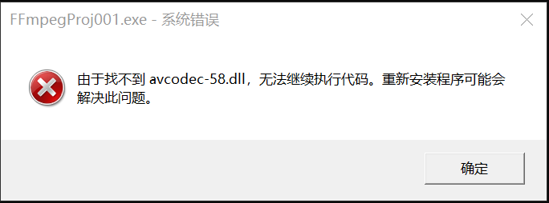
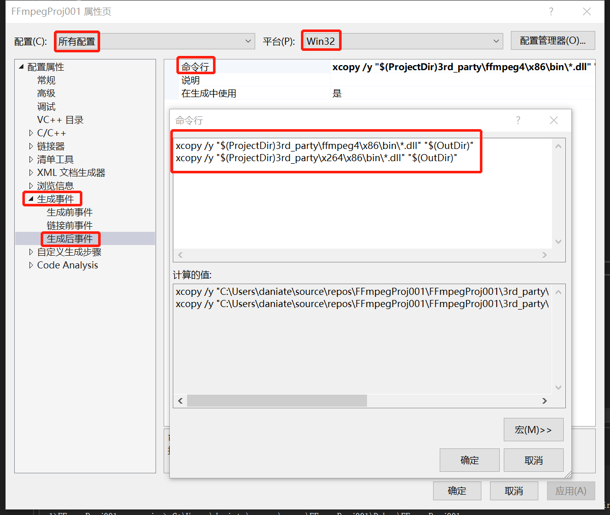

# 在Windows 10中编译x264和FFmpeg

## 安装MSYS2

[https://www.msys2.org/](https://www.msys2.org/)

### 修改msys2_shell.cmd

修改`C:\msys64\msys2_shell.cmd`，将其中的`rem MSYS2_PATH_TYPE=inherit`修改为`MSYS2_PATH_TYPE=inherit`（也就是，去掉前面的`rem `）

### 安装软件包

```shell
pacman -Syu
pacman -S make
pacman -S diffutils
pacman -S yasm
pacman -S nasm
```

### 不使用其link.exe

```shell 
mv /usr/bin/link.exe /usr/bin/link.exe.bak
```

## 编译x264

### 修改编译脚本

```shell
curl "http://git.savannah.gnu.org/gitweb/?p=config.git;a=blob_plain;f=config.guess;hb=HEAD" > config.guess
sed -i 's/host_os = mingw/host_os = msys/' configure
```

### 64位

在`x64 Native Tools Command Prompt for VS 2022`中执行`C:\msys64\msys2_shell.cmd`

然后在弹出的`MSYS`终端中执行以下命令：

```shell
$ CC=cl ./configure --enable-shared --prefix=./../../3rd_party/x264/x64
```

```shell
$ make -j 16 && make install
```

### 32位

在`x86 Native Tools Command Prompt for VS 2022`中执行`C:\msys64\msys2_shell.cmd`

然后在弹出的`MSYS`终端中执行以下命令：

```shell
$ CC=cl ./configure --enable-shared --prefix=./../../3rd_party/x264/x86
```

```shell
$ make -j 16 && make install
```

### 重命名

将以上编译出来的`libx264.dll.lib`重命名为`libx264.lib`，否则，在编译`FFmpeg`时，会出现`ERROR: libx264 not found`

## 编译FFmpeg

### 64位

在`x64 Native Tools Command Prompt for VS 2022`中执行`C:\msys64\msys2_shell.cmd`

然后在弹出的`MSYS`终端中执行以下命令：

```shell
$ CC=cl ./configure \
	--prefix=./../../3rd_party/ffmpeg4/x64 \
	--toolchain=msvc \
	--arch=x86_64 \
	--enable-asm \
	--enable-shared \
	--disable-static \
	--enable-avresample \
	--enable-libx264 \
	--enable-gpl \
	--disable-programs \
	--extra-ldflags="-LIBPATH:./../../3rd_party/x264/x64/lib/" \
	--extra-cflags="-I./../../3rd_party/x264/x64/include/"
```

```shell
$ make -j 16 && make install
```

### 32位

在`x86 Native Tools Command Prompt for VS 2022`中执行`C:\msys64\msys2_shell.cmd`

然后在弹出的`MSYS`终端中执行以下命令：

```shell
$ CC=cl ./configure \
	--prefix=./../../3rd_party/ffmpeg4/x86 \
	--toolchain=msvc \
	--arch=x86_32 \
	--enable-x86asm \
	--enable-shared \
	--disable-static \
	--enable-avresample \
	--enable-libx264 \
	--enable-gpl \
	--disable-programs \
	--extra-ldflags="-LIBPATH:./../../3rd_party/x264/x86/lib/" \
	--extra-cflags="-I./../../3rd_party/x264/x86/include/"
```

```shell
$ make -j 16 && make install
```

## 在Visual Studio中使用

### 修改项目属性

#### 64位





#### 32位





### 处理`由于找不到xxx.dll`导致的运行失败问题



解决方式有三种：

1. 将相关的dll文件复制到系统环境变量Path中的某个目录下（比如：`C:\Windows\System32`）
2. 修改系统环境变量Path，将相关的dll文件所在目录，添加到其中（本质上和第一种是一样的）
3. 将相关的dll文件复制到可执行文件所在目录（手动复制，或在项目属性中进行设置，这样就不必每次手动复制了）

在项目属性中进行设置：



```shell
xcopy /y "$(ProjectDir)3rd_party\ffmpeg4\x86\bin\*.dll" "$(OutDir)"
xcopy /y "$(ProjectDir)3rd_party\x264\x86\bin\*.dll" "$(OutDir)"
```


```shell
xcopy /y "$(ProjectDir)3rd_party\ffmpeg4\x64\bin\*.dll" "$(OutDir)"
xcopy /y "$(ProjectDir)3rd_party\x264\x64\bin\*.dll" "$(OutDir)"
```

## 参考资料

[https://www.roxlu.com/2019/062/compiling-ffmpeg-with-x264-on-windows-10-using-msvc](https://www.roxlu.com/2019/062/compiling-ffmpeg-with-x264-on-windows-10-using-msvc)
[how-to-make-visual-studio-copy-a-dll-file-to-the-output-directory](https://stackoverflow.com/questions/1776060/how-to-make-visual-studio-copy-a-dll-file-to-the-output-directory)
